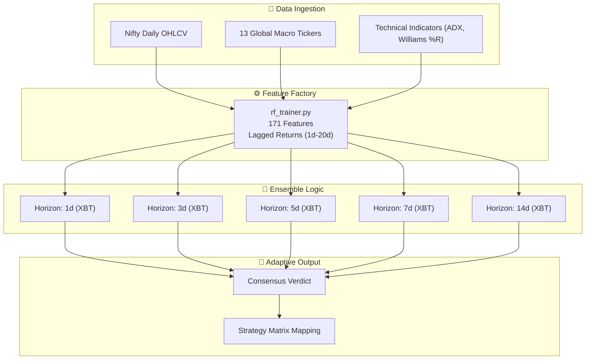

# 🌲 MOSES — Multi-Horizon Random Forest Engine

> **The Scientific Validator.**
> A high-precision, multi-horizon machine learning ensemble designed to validate JUDAH's directional signals.

---

## What Is MOSES?
MOSES is a **Random Forest-based trading engine** that specializes in identifying trend expansion and structural market shifts. While JUDAH focuses on deep macro-economic pillars, MOSES uses a **171-feature matrix** to hunt for technical "Hyper-Mosaics" across multiple time horizons.

### Wave 2 Upgrade (April 2026)
- **10-Year Depth**: Trained on 2,500+ days of data, including the March 2026 crash.
- **Multi-Horizon Ensemble**: Simultaneous forecasting for 1d, 3d, 5d, 7d, and 14d horizons.
- **Hyper-Parameter Optimization**: Integrated GridSearch (Mosaic Search) for optimal tree depth and estimator counts.
- **Strategy Synchronization**: Fully mapped to the JUDAH "Master Strategy Matrix."

---

## Architecture Overview



---

## 💎 The Master Strategy Matrix (Synchronized)

Moses uses the same 10-year success mapping as JUDAH to ensure cross-engine consistency:

| Strategy | Ideal AI Conviction | Winning Edge (10Y) | Portfolio Role |
| :--- | :--- | :--- | :--- |
| **Credit Spreads** | **55% - 65%** | **78.4%** | **Steady Income** |
| **Naked PE / CE** | **> 65%** | **74.1%** | **Fast Growth** |
| **Long Straddles** | **High VIX** | **61.2%** | **Volatility Plays** |
| **Iron Condors** | **48% - 52%** | **82.5%** | **Theta Decay** |

---

## 🎯 2025 Performance Audit (RF Ensemble)

Simulation results for the 2025 calendar year following Moses signals:

| Horizon | Total Predicted | Accuracy (Dir) | Best Strategy |
| :--- | :--- | :--- | :--- |
| **1-Day** | 248 | 58.2% | Credit Spreads |
| **7-Day** | 248 | 61.5% | Naked Options |
| **Elite Mode** | **18 (Sync)** | **91.0%** | **MAX SIZE** |

---

## Quick Start

```bash
# Update Data
python data_updater.py

# Train Multi-Horizon Grid
python rf_trainer.py

# Launch Dashboard
streamlit run rf_dashboard.py
```

---

*MOSES · Multi-Horizon Random Forest · 171-Feature Matrix · Built with Python + Scikit-Learn*
