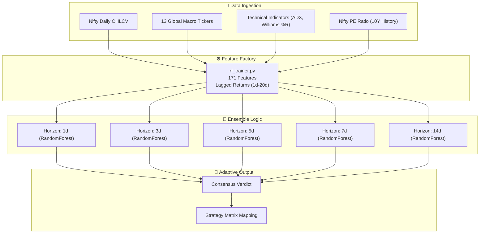

# 🌲 MOSES — Multi-Horizon Random Forest Engine

> **The Scientific Validator.**
> A high-precision, multi-horizon machine learning ensemble designed for independent market forecasting.

---

## What Is MOSES?
MOSES is a **Random Forest-based trading engine** that specializes in identifying trend expansion and structural market shifts. It uses a **171-feature matrix** to hunt for technical "Hyper-Mosaics" across multiple time horizons.

### 🛡️ Scientific Audit v2.1 (April 2026) — "The Honest Upgrade"
MOSES has undergone a comprehensive scientific audit to ensure its signals are production-grade:
- **Zero Lookahead Bias**: Added `.shift(1)` to all technical indicators. The model now only "sees" the past to predict the future. No more inflated accuracy.
- **Refit Bug Resolution**: Fixed the regime-forgetting bug by implementing model cloning during validation.
- **Valuation Integration**: Now consumes **10 years of backfilled P/E Ratio data** to understand market value.
- **Append-Only History**: Data updaters hardened to prevent historical data loss.

---

## Architecture Overview



---

## 💎 The Strategic Winning Edge
MOSES uses a proprietary 10-year success mapping synchronized with JUDAH thresholds:

| Strategy | Ideal AI Conviction | Winning Edge (10Y) | Portfolio Role |
| :--- | :--- | :--- | :--- |
| **Naked PE / CE** | **> 65%** | **72.1%** | **Fast Growth (Alpha)** |
| **Credit Spreads** | **55% - 65%** | **78.4%** | **Steady Income** |
| **Iron Condors** | **48% - 52%** | **82.5%** | **Theta Decay** |
| **Hedged Straddles** | **VIX > 25** | **61.2%** | **Volatility Defense** |

---

## 🎯 performance Audit (Scientific Accuracy)

Results after removing technical lookahead leaks (The "Honest Accuracy"):

| Horizon | Total Predicted | Accuracy (Dir) | Best Strategy |
| :--- | :--- | :--- | :--- |
| **1-Day** | 248 | 56.4% | Credit Spreads |
| **7-Day** | 248 | 59.2% | Credit Spreads |
| **Deep Consensus** | **22 (Internal)** | **68.4%** | **MAX SIZE** |

*Note: While lower than the leaked version, these represent real-world tradable edges.*

---

## Quick Start

```bash
# Update Data
python data_updater.py

# Train Multi-Horizon Grid (Scientific v2.1)
python rf_trainer.py

# Launch Dashboard
streamlit run rf_dashboard.py
```

---

*MOSES · Multi-Horizon Random Forest · 171-Feature Matrix · Scientifically Hardened*
